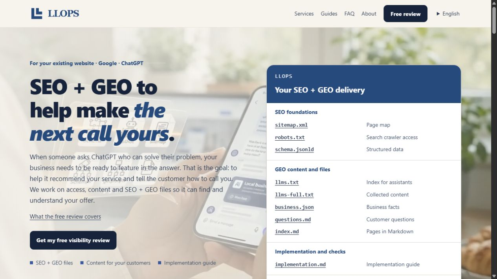
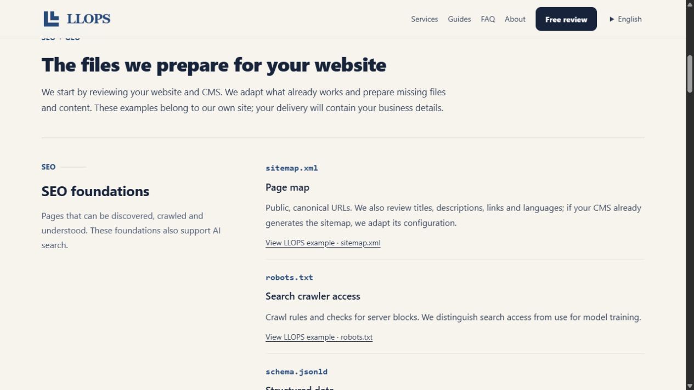
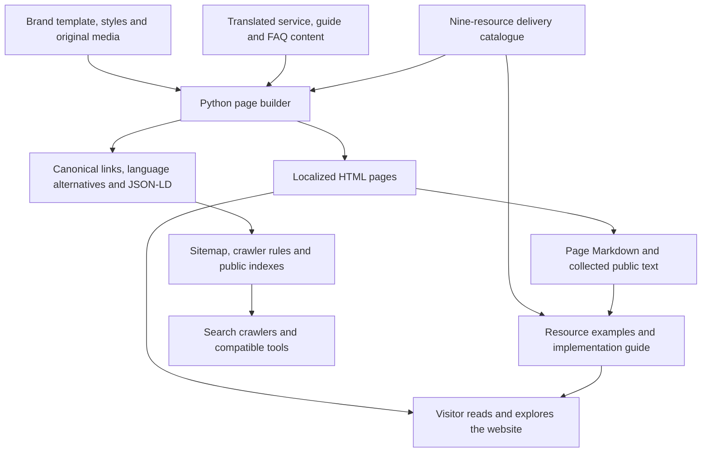
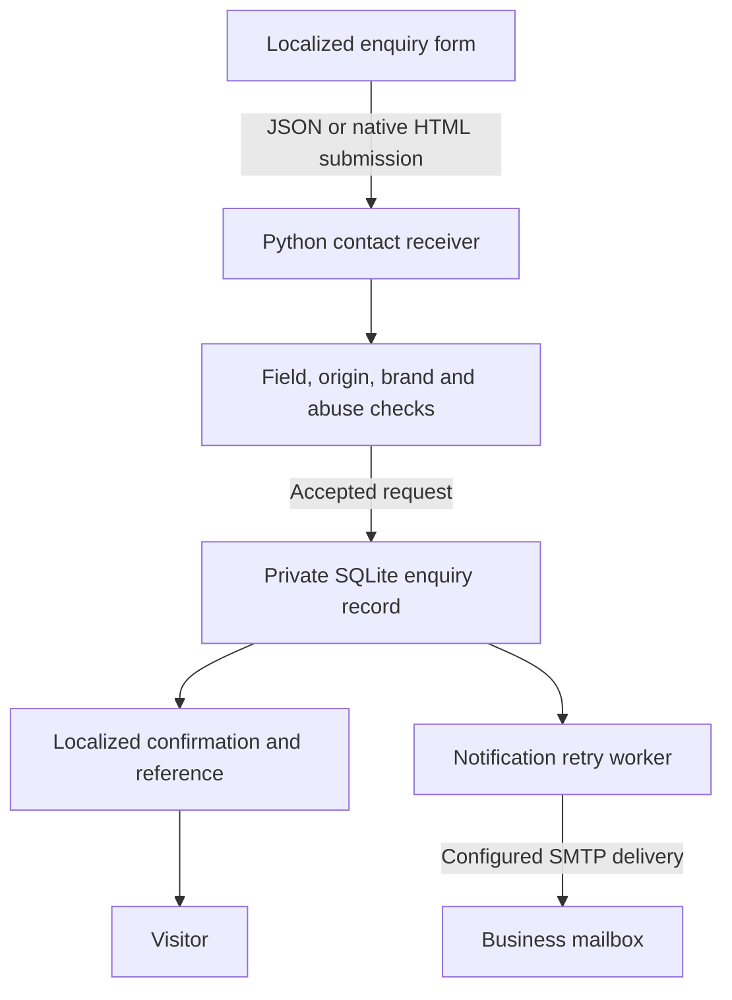
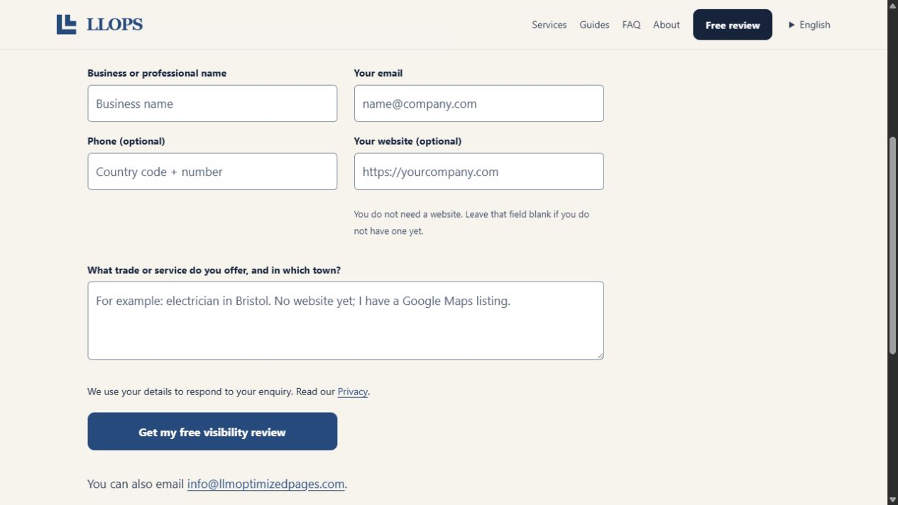

# LLOPS

### SEO + GEO for existing websites, with delivery examples you can inspect

LLOPS — LLM Optimized Pages — presents a practical service for improving how an existing business website explains its offering to people, search engines and AI-assisted search. The website makes that work tangible through a catalogue of concrete resources, public examples, implementation guidance and a localized enquiry flow.

**[Explore the official website →](https://llmoptimizedpages.com/en/)**

*Actual English homepage captured from the public website on 12 September 2026, showing its service proposition and linked delivery overview.*

## A service whose output is visible

An existing website can have useful services but leave its information scattered, inconsistent or difficult to navigate. LLOPS starts with that website and its CMS: review the public pages, define the missing work, prepare the content and technical resources, and explain how each change should be applied and checked.

The product is a service website and an example of its own delivery approach. Its public resources belong to LLOPS. They let visitors inspect the structure and purpose of the work; they are not a universal package to install unchanged on another business's site.

LLOPS and GarantLead address distinct needs within a shared implementation. GarantLead focuses on creating websites for service businesses. LLOPS focuses on SEO/GEO review, preparation and maintenance for an existing website.

## From a broad promise to nine concrete resources

The homepage groups its delivery into **SEO foundations**, **GEO content and files**, and **implementation and checks**. Each item explains its role and links to a real example published by the site.

| Resource | What the website demonstrates |
| --- | --- |
| **sitemap.xml** | A map of public canonical pages and their language alternatives. |
| **robots.txt** | Published crawler-access rules, with public discovery separated from private enquiry endpoints. |
| **schema.jsonld** | Structured business, service and page descriptions based on the visible website. |
| **llms.txt** | A supplementary index connecting services, guides and contact information. |
| **llms-full.txt** | Collected public text with its source-page context. |
| **business.json** | A reusable directory of the site's stated business facts, languages, services and links. |
| **questions.md** | The website's service questions and answers in a readable text format. |
| **index.md** | A Markdown version of each public page, linked to its canonical HTML page. |
| **implementation.md** | The purpose, placement and checking steps for the example resources. |

The examples are generated from the same content used for the visible pages. This gives the catalogue a concrete relationship to the site rather than presenting decorative filenames with no corresponding resource.

*Actual English delivery catalogue captured on 12 September 2026. This view shows the SEO foundations and links to the site's real sitemap, crawler rules and structured-data examples.*

## Content that supports a decision

The service section separates three kinds of work: an SEO/GEO audit, Schema.org structured-data preparation, and ongoing SEO/GEO maintenance. Guides explain the role of public access, useful pages, business identity and the different supporting files. FAQ, About and Contact pages provide the scope and next step without requiring a visitor to interpret the technical formats first.

The site is generated in **Czech, Spanish and English**, with a separate HTML document for each localized route. Its content model currently produces twelve pages per language: the homepage, three service details, two guides, their listing pages, FAQ, About, Contact and Privacy.

Navigation and text remain available without JavaScript. Language links preserve the corresponding localized page. At an unlocalized entry, the language handler considers an explicit choice, a remembered preference and the browser's accepted languages; already localized URLs keep their language.

## How the site is built

The implementation combines a brand-specific HTML/CSS base with shared Python content and page-generation modules. The builder replaces the base template's translation markers, navigation and original form, then creates the actual localized site.

The builder also prepares shared navigation, breadcrumbs, social metadata, localized error pages and guide feeds. HTML, metadata and text exports are produced from the same page definitions. The browser adds form feedback, a remembered language selection and the site's background-video behavior.

## An enquiry has a receipt

The contact flow asks for the business name, email, trade/service and locality. Phone and website are optional, so a business can request a visibility review before it has a website.

The enhanced form validates fields, shows localized errors, prevents simultaneous duplicate submissions and keeps a request identifier for an uncertain retry. A native HTML submission path remains available without JavaScript.

The server records an accepted enquiry before returning its reference. Email notification is a separate step: a temporary delivery problem does not turn the accepted request into an unrecorded browser-only message. The implementation includes duplicate-request checks and scheduled retention of the form records. Private enquiry data is outside the public website output.

*Actual English contact form captured from the public website on 12 September 2026. The fields are empty and display their built-in examples; no enquiry was submitted for the capture.*

## Implementation stack

| Layer | Role |
| --- | --- |
| Python and Beautiful Soup | Assemble localized pages, replace template sections and derive public content exports. |
| HTML and CSS | Deliver the responsive site, content pages and resource catalogue. |
| Browser JavaScript | Enhance language preference, validation, receipt feedback and video behavior. |
| Python HTTP service | Handle language entry and the validated contact endpoint. |
| SQLite | Persist accepted enquiries and supporting request-control state privately. |
| SMTP worker | Send configured enquiry notifications with retries. |
| Pillow and media tooling | Prepare the site's existing branding and web media assets during the build. |

## Current scope

The website exposes service information, real examples and an enquiry channel. It does not automatically rewrite a customer's CMS, run an AI recommendation engine, generate a customer-specific package from the public form or process a purchase in the reviewed flow.

LLOPS explicitly presents its supplementary files as part of broader website work. Their publication does not guarantee search rankings, AI citations, recommendations or customer enquiries. The public examples show the implementation approach; they are not evidence of measured client outcomes.

## About this repository

This repository is the public showcase for the LLOPS website: a description of the actual product, genuine interface captures and implementation-based diagrams. Application source, customer enquiries, credentials and operational configuration remain private.

**Last showcase review:** 2026-09-12 (Europe/Paris).
